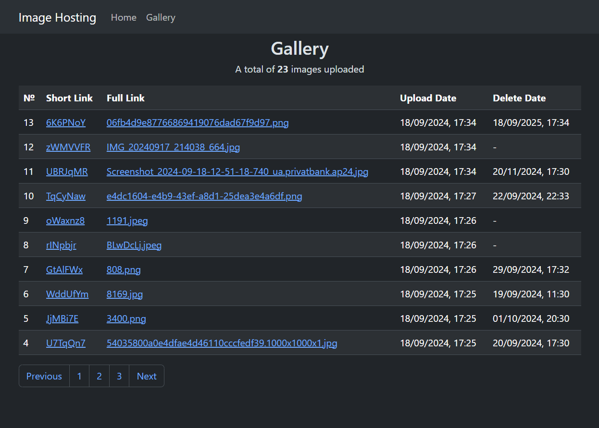
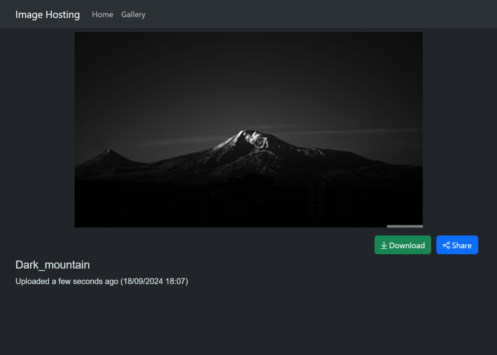

# Image Hosting

A simple Flask application for hosting images

## Screenshots





## Installation

Clone the repo:

```
git clone https://github.com/katolik163/flaskimagehosting.git
cd flaskimagehosting
```

Create and activate virtual environment then install dependencies:

```
py -m venv .venv
.venv/Scripts/activate
pip install -r requirements.txt
```

Edit ```.flaskenv``` and ```config.py```

Create database:

```
flask db upgrade
```

Run application:

```
flask run
```